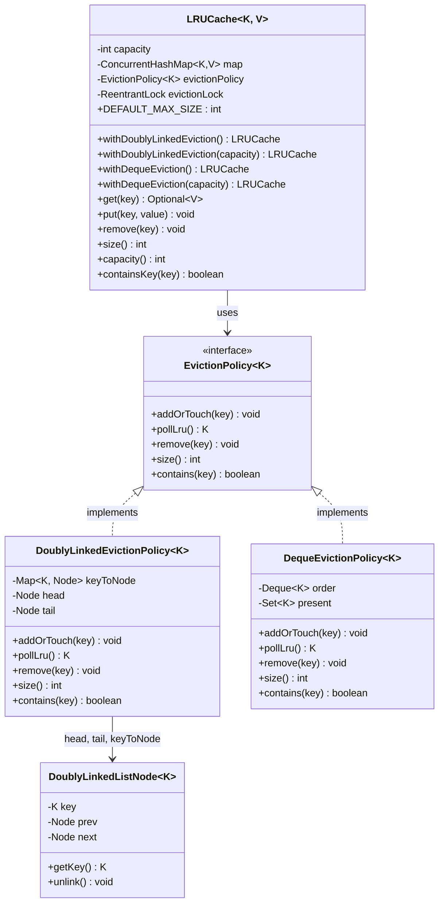
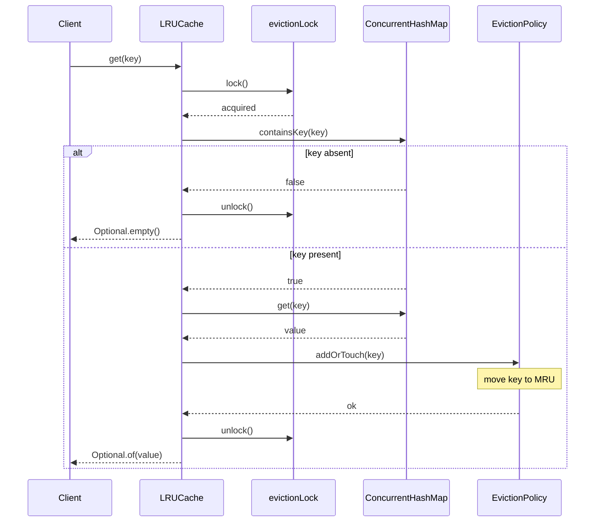
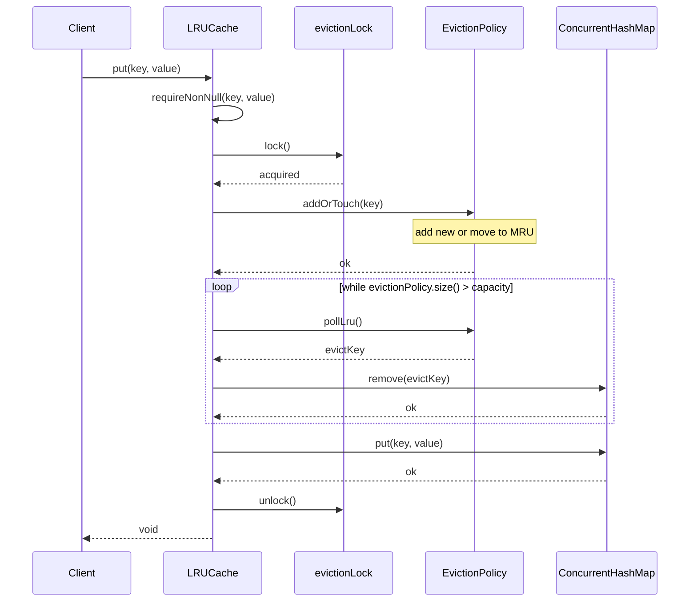
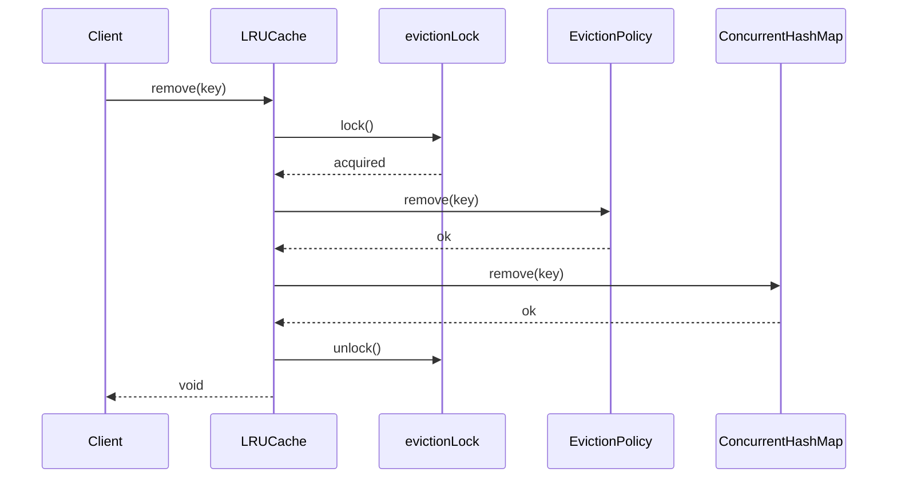
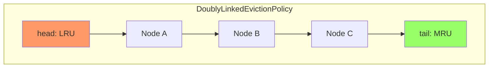
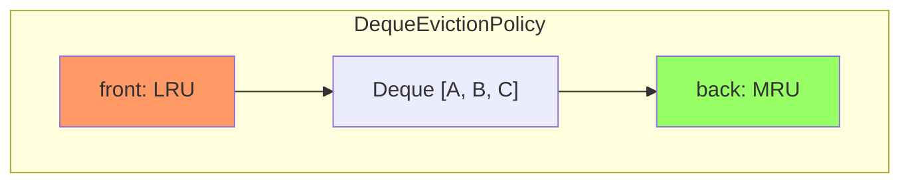
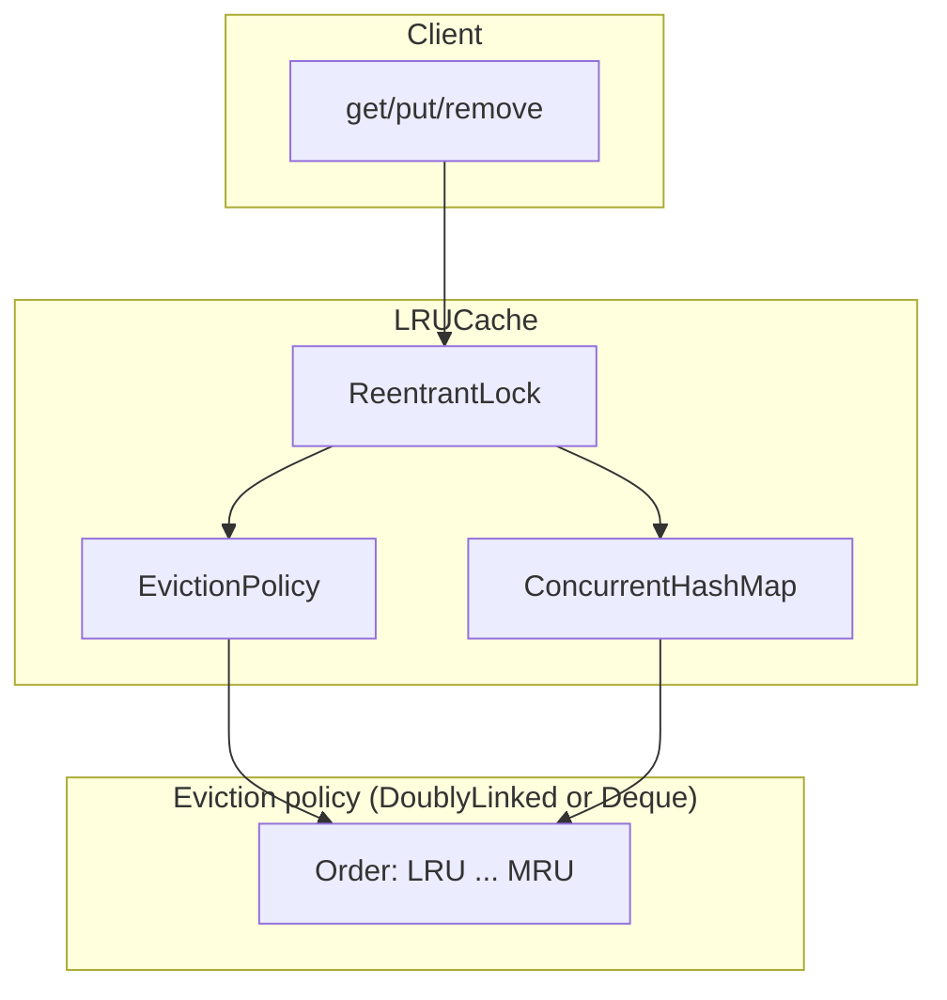
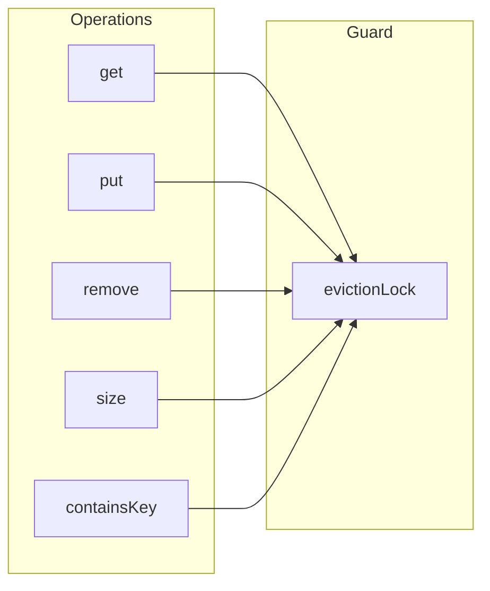

# LRU Cache — Flows & Architecture

Mermaid diagrams for the thread-safe LRU cache (ConcurrentHashMap + pluggable eviction).

---

## 1. Class diagram



---

## 2. Get flow (sequence)



---

## 3. Put flow (sequence)



---

## 4. Remove flow (sequence)



---

## 5. Get flow (flowchart)

```mermaid
flowchart TD
    A[get(key)] --> B[Lock]
    B --> C{map.containsKey(key)?}
    C -->|No| D[Unlock]
    D --> E[Return Optional.empty()]
    C -->|Yes| F[value = map.get(key)]
    F --> G[evictionPolicy.addOrTouch(key)]
    G --> H[Unlock]
    H --> I[Return Optional.of(value)]
```

---

## 6. Put flow (flowchart)

```mermaid
flowchart TD
    A[put(key, value)] --> B[Validate key, value non-null]
    B --> C[Lock]
    C --> D[evictionPolicy.addOrTouch(key)]
    D --> E{evictionPolicy.size() > capacity?}
    E -->|Yes| F[pollLru() -> evictKey]
    F --> G[map.remove(evictKey)]
    G --> E
    E -->|No| H[map.put(key, value)]
    H --> I[Unlock]
    I --> J[Return]
```

---

## 7. Eviction policy — Doubly linked list layout



- **Evict**: remove from `head`, advance head.
- **Touch / Add**: add or move node to `tail` (MRU).

---

## 8. Eviction policy — Deque layout



- **Evict**: `pollFirst()` (front).
- **Touch / Add**: remove key if present, then `addLast(key)` (MRU).

---

## 9. End-to-end flow (cache + eviction)



---

## 10. Thread safety (all operations under lock)



Every public operation that reads or updates the map or the eviction policy does so while holding `evictionLock`, so the cache is thread-safe and the maximum size (default 100) is enforced consistently.
